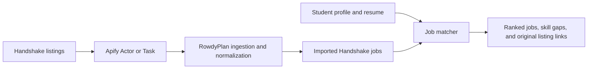

# Handshake Scraping and Student Matching

RowdyPlan can run an Apify Actor or saved Task, import its Handshake job dataset,
and score those real listings against a student's profile. You need your own
working Handshake Actor/Task and Apify token to fetch live data. An Apify token
authenticates to Apify; it does not log you into Handshake.

The current recommendation engine is a deterministic matcher, not a trained
prediction of whether someone will get hired. It works without an LLM API key
or model training. The last section describes how to add a trained ranking model.

## Your Selected Actor: maximedupre/handshake-jobs-scraper

Use the Actor shown in your screenshot:
[`maximedupre/handshake-jobs-scraper`](https://apify.com/maximedupre/handshake-jobs-scraper).
It reads public listings; its documentation says it does not need a Handshake
login or Handshake API key. Institution-only results are outside its coverage.

You need one secret: your Apify token. Open
[Settings > API & Integrations](https://console.apify.com/settings/integrations),
create a token named `RowdyPlan`, and keep it in `backend/.env`.
The Actor ID below is a public identifier, not a secret.
See [Apify token documentation](https://docs.apify.com/integrations/api).

### Fix the October 4 Run That Returned Zero Jobs

The attached log ends with `Scraped 0 Handshake job listings`. The Actor started
and finished; the log does not show an authentication failure. The
`LIMITED_PERMISSIONS` startup line is not the failure reported by this run.

The warning URLs contain entire rows from the keyword table, for example:

```text
/find-jobs/san-antonio-tx/computer-science-it-software-engineer-intern-data-analyst-intern-cybersecurity-intern/
```

That is one combined search phrase, not three searches. My earlier table was
not clear enough: never paste a whole row, a major heading, or a comma-separated
list into a single keyword entry. Each individual role phrase needs its own
array element. Also, correctly formatted keywords are not enough if the Actor
generates a public search path that Handshake does not publish.

On October 4, 2026, a direct HTTP check returned 404 for
`https://joinhandshake.com/find-jobs/austin-tx/software-engineer/`, but returned
200 for the actual
[San Antonio public jobs page](https://joinhandshake.com/find-jobs/san-antonio-tx/).
Use that existing page to test URL-based discovery first.

1. Open the Actor's **Input > JSON** tab.
2. Replace the entire input with this small diagnostic configuration, also in
   [`handshake-apify-smoke-input.json`](../backend/examples/handshake-apify-smoke-input.json):

```json
{
  "keywords": [],
  "locations": [],
  "startUrls": [
    {"url": "https://joinhandshake.com/find-jobs/san-antonio-tx/"}
  ],
  "employmentTypes": [],
  "workplace": "any",
  "maxDiscoveryItems": 5
}
```

3. Click **Save & start**, then open the run's dataset/output.
4. Confirm it contains actual titles, employers, descriptions, and listing URLs
   before expanding the searches or importing into RowdyPlan.

Empty keyword/location arrays avoid the old generated searches. No date, pay,
or employment-type restriction is applied. The Actor documents public search
and job URLs in `startUrls`; see its
[input schema](https://apify.com/maximedupre/handshake-jobs-scraper/input-schema).
An accessible page is not proof that the Actor can extract it: this configuration
still needs a run in your Apify account.

If this returns zero too, check the page in a logged-out browser. If it displays
jobs there, file an
[Actor issue](https://console.apify.com/actors/U9L6iHxM3Nz49PFp7/issues)
with this small input, the run ID, and the new log. That isolates a possible
Actor extraction problem or request blocking from the malformed keyword issue.
You can also test one real public job URL copied from that page in `startUrls`,
with keywords empty. Do not use invented IDs or private account search URLs,
and do not share your Apify token or Handshake session cookies in the issue.

### Broaden to Multiple Fields After the Diagnostic Works

A ready-to-use JSON input is in
[`handshake-apify-input.json`](../backend/examples/handshake-apify-input.json).
It now uses actual public city and job-category URLs instead of generating
paths from arbitrary job titles. Its role pages include software engineering,
data analytics, accounting, marketing, human resources, mechanical engineering,
public health, teaching, graphic design, and supply chain. The role pages are
not limited to Texas. The city pages include multiple fields, but neither this
list nor a 200-job sample guarantees coverage of every major.

Enter its contents in the Actor's JSON input tab, then click Save & start.
Keep Workplace at `any` and date/pay filters unset until you have results.
For additional fields, follow Handshake's public category links and confirm the
page displays jobs before adding its URL to `startUrls`.

Once the five-job diagnostic works, change `maxDiscoveryItems` to `200` in
the editable Actor input and click **Save & start**. Keep the working URLs and
empty keyword/location arrays. Both the broader Actor example and backend
import example now request up to 200 jobs. The diagnostic example stays at five
so it remains useful for troubleshooting. The cap is a maximum, not a promise
that the source pages contain that many discoverable jobs.

If the backend import reaches the synchronous API's 300-second ceiling, reduce
the cap to 50 or 100 and collect separate job-family batches. Do not raise the
HTTP timeout expecting it to extend Apify's synchronous execution window.

### Optional Keyword Searches

These are starter search suggestions, not an exhaustive list of majors:

| Major or field | Job keywords to add |
| --- | --- |
| Computer Science / IT | software engineer intern, data analyst intern, cybersecurity intern |
| Accounting / Finance / Economics | accounting intern, finance intern, financial analyst intern |
| Business / Marketing / HR | marketing intern, human resources intern, business analyst intern |
| Engineering / Construction | mechanical engineering intern, civil engineering intern, electrical engineering intern, construction management intern |
| Biology / Chemistry / Environmental Science | laboratory assistant, research assistant, environmental science intern |
| Health / Public Health | clinical research assistant, public health intern, healthcare administration intern |
| Psychology / Sociology / Social Work | social services intern, behavioral health technician, community outreach intern |
| Education / Humanities | teaching assistant, education intern, museum intern, writing intern |
| Arts / Communication | graphic design intern, communications intern, journalism intern |
| Criminal Justice / Politics | criminal justice intern, public policy intern, legal assistant |
| Supply Chain / Hospitality | supply chain intern, logistics intern, hospitality intern |

These are role ideas, not verified public search paths. If trying Keywords,
add only one phrase per entry, for example
`["accounting intern", "finance intern"]`, without the major label or table
formatting. Check the generated URLs in the log. If they are unavailable,
use real public URLs in `startUrls` instead. Do not repeatedly run a larger
keyword list when the small search already returns no public pages.

The 200-job cap is shared across the entire run. A broad search is useful for
the first connection test but does not ensure equal coverage of every field.
For regular collection, use separate job-family Tasks, such as Business,
Engineering, Science, Education, and Arts, with working public URLs and a cap
per Task. All Tasks can use the same Apify token and import into the same
deduplicated job collection. For a remote-only Task, use a public page that
contains remote jobs and set Workplace to `remote`.

### Load Completed Apify Results Into the App

The backend can now import the latest successful run without starting another
scrape. Set the token and Actor ID in `backend/.env` as shown below, then restart
the backend. From the project root:

```bash
curl --fail-with-body --max-time 60 \
  -X POST http://127.0.0.1:8001/api/admin/ingest \
  -H 'Content-Type: application/json' \
  --data-binary @backend/examples/handshake-import-latest.json
```

This uses `{"provider":"handshake","use_latest_run":true}` and reads the
latest `SUCCEEDED` run's dataset. It normalizes the original Handshake listings
and updates existing jobs by source identity. A completed run with zero output
does not become a successful job import merely because its run status succeeded.
See [Apify's latest-run dataset API](https://docs.apify.com/api/v2/actor-runs-last-dataset-items-get).

To import a particular dataset instead, use:

```json
{"provider":"handshake","dataset_id":"YOUR_DATASET_ID"}
```

Open the local app and choose **Build My Plan**. Normal onboarding loads the
latest completed Handshake results automatically when no imported jobs are in
the local store. **Sync Handshake** on the dashboard imports the latest completed
run again and refreshes the current student's matches. Neither action starts a
new scraper run. **Explore Demo** still uses labeled sample UTSA listings.

Keep credentials only in the backend environment. If a token is exposed in a
screenshot or chat, rotate/revoke it in Apify, update `backend/.env`, and restart
the backend. The `.env` file is excluded from Git; never put tokens in frontend
JavaScript, request bodies, examples, or documentation.

### Daily Scraping in Apify

The existing `my-schedule` was verified and updated on October 4, 2026:

- Enabled, with cron `46 8 * * *` and timezone `America/Chicago`.
- Next run: October 5, 2026, at 8:46 AM Central.
- Actor: `maximedupre/handshake-jobs-scraper`.
- Input: the working San Antonio public jobs URL, empty keyword/location
  arrays, Workplace `any`, and `maxDiscoveryItems: 200`.

Manage it in [Apify Console > Schedules](https://console.apify.com/schedules).
There is no need to create another schedule. Apify runs the scraper in its
cloud, so the laptop does not need to stay on for scraping.
See [Apify's schedule documentation](https://docs.apify.com/actors/running/schedules).

**This schedule repeats daily; it does not currently stop after one day.**
For tomorrow only, disable it after the October 5 run. Do not leave it enabled
if only one additional run is intended. Runs may consume Apify credits.

After a scheduled run succeeds, open the local dashboard and click
**Sync Handshake** to import its new results and refresh matches. Scheduling
the Actor does not automatically push data into the running local backend.
Cloud webhooks cannot reach `127.0.0.1`; unattended imports need a deployed
backend with a secured public endpoint or a local polling worker.
The current job store is in memory, so a backend restart clears imported jobs;
onboarding can load the latest completed dataset again.

### Start a New Scrape From the Backend

You do not need a Task ID for this approach. Set:

```dotenv
APIFY_API_TOKEN=YOUR_REAL_APIFY_TOKEN
APIFY_HANDSHAKE_ACTOR_ID=maximedupre~handshake-jobs-scraper
APIFY_HANDSHAKE_TASK_ID=
APIFY_HANDSHAKE_INPUT={}
APIFY_TIMEOUT_SECONDS=300
```

Restart the backend after changing the environment. From `backend/`, import
using the provided input file:

```bash
curl --fail-with-body --max-time 330 \
  -X POST http://127.0.0.1:8001/api/admin/ingest \
  -H 'Content-Type: application/json' \
  --data-binary @examples/handshake-ingest.json
```

This import starts an Actor run. It does not read the dataset of the earlier
Console test. Successful imports return `status: "complete"` with `added` and
`updated` counts. Choose Build My Plan in the local app to use these listings.

For multiple saved Tasks, pass a specific Task ID per import:

```json
{"provider":"handshake","task_id":"YOUR_BUSINESS_TASK_ID","limit":200}
```

The adapter now accepts this Actor's `descriptionText`, `descriptionHtml`,
`employmentTypes`, employer, workplace, and structured pay output. See the
[Actor output schema](https://apify.com/maximedupre/handshake-jobs-scraper/output-schema).

### Matching Students Across Majors

Scraping and career guidance need separate coverage checks. Job matching can
compare any supplied skills and major requirements, but the current career
database and automatic skill vocabulary are mostly technology-focused.
Adding search keywords does not fix that model coverage by itself.

To support all majors well, extend the skill vocabulary, career profiles,
certifications, and recommended experiences for each field. Evaluate rankings
using real example students from business, education, health, arts, humanities,
science, and engineering, with advisor-reviewed relevance labels. Do not use
a keyword match as proof of degree or licensing eligibility.

The current matcher needs no additional AI key. A trained predictive ranker
requires relevant labels and evaluation; the final section describes that work.



## 1. Get a Working Apify Task

1. In Apify Console, choose or create an Actor that actually extracts Handshake
   job listings. Verify its documented authentication method and input fields.
2. Configure its Handshake URLs, search filters, login/session requirements,
   and result cap using that Actor's Input tab. Start with a small batch.
3. Run it in Apify Console. Confirm the run succeeds and its dataset contains
   job titles, employer names, descriptions, and original listing URLs.
4. Save the working configuration as a Task. Copy the Task ID from its API
   information, and get an API token from your Apify account settings.

Saved Tasks keep the Actor-specific configuration in Apify. There is no universal
Handshake input JSON: fields such as `school` and `maxItems` only work if your
chosen Actor supports them. See [Apify Task documentation](https://docs.apify.com/actors/running/tasks).

Useful dataset fields look like this. This is a schema example, not an imported job:

```json
{
  "jobId": "ACTUAL_HANDSHAKE_JOB_ID",
  "jobTitle": "Software Engineering Intern",
  "companyName": "Employer name",
  "jobDescription": "Build Python and React services using SQL.",
  "qualifications": "Computer Science major; GPA 3.0+",
  "skills": ["python", "react", "sql"],
  "eligibleMajors": ["Computer Science"],
  "graduationYears": ["2028"],
  "locations": ["San Antonio, TX"],
  "employmentType": "Internship",
  "minimumGpa": 3.0,
  "applicationDeadline": "2027-03-01",
  "jobUrl": "https://app.joinhandshake.com/jobs/ACTUAL_HANDSHAKE_JOB_ID"
}
```

The provider accepts common alternatives such as `title`, `description`,
`employer.name`, `company.name`, `location`, and `url`. If your Actor uses other
names, add them to the field mappings in
[`handshake_provider.py`](../backend/app/ingestion/handshake_provider.py).
Prefer explicit eligibility fields over trying to infer them from prose.

## 2. Configure and Start RowdyPlan

From the project root, create a local environment if you do not already have one:

```bash
cd backend
python3 -m venv .venv
source .venv/bin/activate
python3 -m pip install -r requirements.txt
cp -n .env.example .env
```

Set these values in `backend/.env`, replacing the token and Task ID:

```dotenv
APIFY_API_TOKEN=YOUR_APIFY_TOKEN
APIFY_HANDSHAKE_TASK_ID=YOUR_ACTUAL_TASK_ID
APIFY_HANDSHAKE_INPUT={}
APIFY_TIMEOUT_SECONDS=300
```

Leave `APIFY_HANDSHAKE_ACTOR_ID` unset when using a Task. A Task takes precedence
if both IDs are configured. Keep the token in the backend environment.

If you run an Actor directly instead, set `APIFY_HANDSHAKE_ACTOR_ID` to its ID or
`owner~actor-name`, leave the Task ID unset, and set `APIFY_HANDSHAKE_INPUT` to the
exact input JSON that succeeded in that Actor's Console test.

Start the server from `backend/` so settings load `backend/.env`:

```bash
python3 -m uvicorn app.main:app --reload --host 127.0.0.1 --port 8000
```

Open `http://127.0.0.1:8000` for the frontend and
`http://127.0.0.1:8000/docs` for the interactive API. Use a different port if
8000 is occupied, and update the URLs in the commands below.

PostgreSQL and Redis are not required for the current demo API. Its routes use
an in-memory store, even if a database connection is configured. Imported jobs,
student profiles, and feedback disappear on restart. Use one server worker for
this setup; persistent database-backed routes are needed for deployment.

## 3. Import Handshake Jobs

In another terminal:

```bash
curl --fail-with-body --max-time 330 \
  -X POST http://127.0.0.1:8000/api/admin/ingest \
  -H 'Content-Type: application/json' \
  -d '{"provider":"handshake","limit":200}'
```

The response reports `status`, `provider`, `fetched`, `added`, and `updated`.
Repeated ingestion updates existing listings using their source ID or URL.
`limit` limits how many returned items RowdyPlan imports; set the Actor's own
result cap in Apify to limit the scraping run itself.

Check the actual imported listings:

```bash
curl --fail-with-body http://127.0.0.1:8000/api/admin/ingestion-status
curl --fail-with-body 'http://127.0.0.1:8000/api/opportunities?source=handshake'
```

Check that listings contain `source: "handshake"`, a title, the right employer,
skills, and a real application URL. The startup UTSA seed is sample data and
uses `source: "utsa"`; it is not a successful Handshake scrape.

This integration uses Apify's synchronous dataset endpoint, which has a
300-second ceiling. Increasing the local HTTP timeout does not extend that
ceiling. If a run times out, inspect it in Apify before starting another one:
the Actor may still be running. For larger batches, implement asynchronous
run creation, status polling, and dataset retrieval in a background worker.
See [Apify synchronous Task API](https://docs.apify.com/api/v2/actor-task-run-sync-get-dataset-items-post).

## 4. Match a Student to Imported Jobs

In the frontend, choose **Build My Plan**. Enter the student's academic details,
career interests, actual skills, coursework, experience, location preferences,
and optional resume. The app requests Handshake listings only. With no imports,
it shows an empty job state while still generating career guidance.
**Explore Demo** uses a sample senior CS profile and labeled UTSA demo listings.

To test the matching endpoint directly, run from `backend/`:

```bash
curl --fail-with-body \
  -X POST http://127.0.0.1:8000/api/rowdy-plan/generate-inline \
  -H 'Content-Type: application/json' \
  --data-binary @examples/handshake-student.json
```

The example profile is editable JSON. The response includes `student_id`,
`job_matches`, `career_matches`, `skill_gaps`, and `timeline`. Every returned job
should have `source: "handshake"`, its original `url`, and a score breakdown.

For an already-created student, substitute the returned ID:

```bash
curl --fail-with-body \
  'http://127.0.0.1:8000/api/jobs/recommendations?student_id=STUDENT_UUID&source=handshake'
```

## 5. Understand and Check the Matcher

[`job_matcher.py`](../backend/app/recommendation/job_matcher.py) combines six
subscores, each from 0 to 100:

| Weight | Signal |
| --- | --- |
| 35% | Matching skills, including resume and project evidence |
| 20% | Experience and project relevance |
| 15% | Major, GPA, coursework, and certifications |
| 10% | Career interests |
| 10% | Location and work preferences |
| 10% | Internship, full-time, or other goal alignment |

The engine handles aliases such as CS / Computer Science and JS / JavaScript.
It also checks graduation year and stated work authorization. A failed hard
requirement sets `NOT_ELIGIBLE` and caps the match score at 39. Missing student
information for a listed hard requirement returns `UNKNOWN`.

An 80% match is an alignment score, not an 80% probability of an offer.
Extraction from free-form job descriptions is approximate. Inspect a sample
of imported eligibility fields against the original postings, especially
citizenship, sponsorship, preferred versus required skills, and graduation years.

Run the automated checks from `backend/`:

```bash
python3 -m pytest app/tests -q
```

For a practical quality check, have an advisor label the relevance of a shared
set of real jobs for several different profiles. Confirm that changing skills
and goals changes the ordering, unrelated jobs rank lower, failed GPA/major
requirements are respected, and application links open the correct listings.
Automated tests verify behavior; human relevance labels assess recommendation quality.

## 6. Add a Trained Predictive Ranking Model Later

These are next steps, not an existing training pipeline:

1. Persist jobs, versioned student profiles, recommendation impressions, and
   feedback in PostgreSQL. Record which jobs were shown, their positions,
   timestamps, and the feature values used at that time.
2. Use the existing `POST /api/feedback` endpoint to record `job_viewed`,
   `job_saved`, `job_dismissed`, and `job_applied` events with the actual
   `opportunity_id`. The frontend still needs comprehensive event instrumentation.
   An application-link click is not proof that an application was submitted.
3. Collect relevance labels from students/advisors. For an initial preference
   ranking target, use ordered labels such as dismissed, viewed, saved, and
   confirmed applied. Do not label unshown jobs as rejected or use the current
   match score as the training target.
4. Train a ranking model on the six subscores plus meaningful skill coverage,
   experience, and freshness features. My proposed next model is
   [LightGBM LGBMRanker](https://lightgbm.readthedocs.io/en/stable/pythonapi/lightgbm.LGBMRanker.html)
   with `objective="lambdarank"`; it accepts groups of jobs per ranking request.
   It requires a new dependency and sufficient real relevance data.
5. Keep each recommendation request's jobs together when splitting data.
   Evaluate on later requests and separately on held-out students. Check ranking
   quality using [NDCG at 10](https://scikit-learn.org/stable/modules/generated/sklearn.metrics.ndcg_score.html)
   and compare it to this deterministic matcher on the same labeled candidates.
6. Keep hard eligibility checks outside the learned ranking score. Save the
   trained artifact with its feature schema and version, load it at startup,
   and retain the deterministic scorer as a fallback.

To predict interview or offer probability instead, you need confirmed interview
or offer outcomes and separate calibration and validation. Clicks and saves
alone cannot validate that prediction.

## Troubleshooting

| Symptom | Check |
| --- | --- |
| 422: token or Actor/Task missing | Set the backend environment and restart the server. |
| Apify authentication or not-found error | Verify the token and exact resource ID in Apify Console. |
| `No public Handshake search page was available` | Inspect the generated URL. Remove combined table rows from Keywords and test the URL-based diagnostic input above. |
| Run succeeds but its dataset contains zero jobs | Use one accessible public URL with keyword/location arrays empty and date/pay filters unset. If it still fails, report the input and run log to the Actor author. This Actor does not use a Handshake login. |
| Dataset has jobs but RowdyPlan imports zero | Check the imported dataset shape and title mappings in `handshake_provider.py`. |
| Startup log says `LIMITED_PERMISSIONS` | This line did not stop the attached run; inspect subsequent warnings and dataset counts for the actual problem. |
| Timeout | Reduce the Actor's batch size; check the existing run before retrying. |
| Jobs vanish after a code change | Reload restarts the in-memory store. Re-import jobs or add database persistence. |
| Matches show demo employers | Use `opportunity_source: "handshake"`, or Build My Plan rather than Explore Demo. |
| Scheduling Apify does not update RowdyPlan | A schedule runs the Actor only. A worker/webhook must import that run's dataset into RowdyPlan. |
| Low scores for a strong student | Check imported requirements, skills, and profile inputs before adjusting weights. |
